# Tomcat学习
> Tomcat 服务器是一个开源的轻量级Web应用服务器，在中小型系统和并发量小的场合下被普遍使用，是开发和调试Servlet、JSP 程序的首选。

## Tomcat结构

### Tomcat要做什么
浏览器发起请求 -> Tomcat -> 解析数据，找到对应servlet -> 执行servlet -> 封装数据并返回 

### Tomcat访问服务器的流程
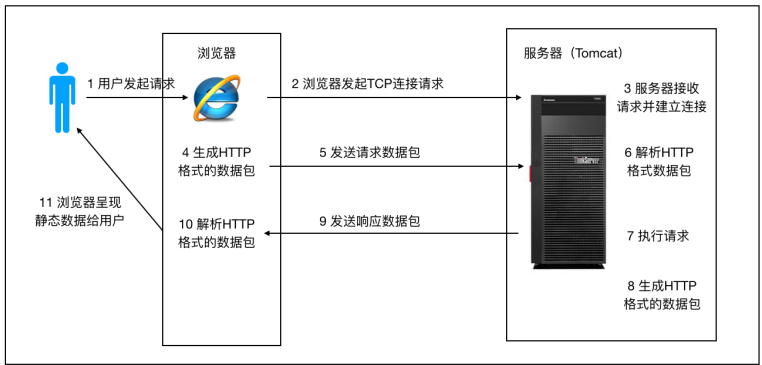

由上图可以看出以下几点：
1. 浏览器访问服务器使用的是http协议，http是应用层协议，用于定义数据通信的格式，具体的数据传输使用的是TCP/IP协议
2. tomcat职责：将对应请求解析并执行，再包装为http格式数据包返回（tomcat并不是只支持http协议）

### Tomcat系统总体架构
#### Tomcat请求处理大致过程
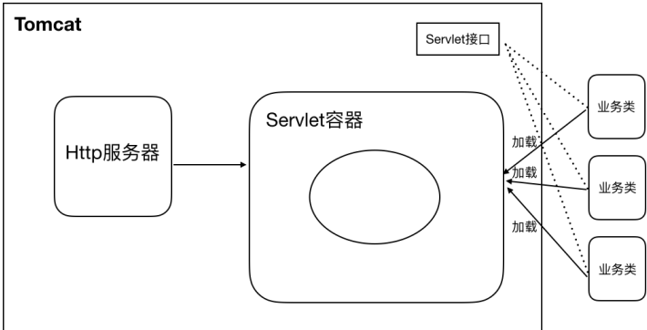

- HTTP 服务器接收到请求之后把请求交给Servlet容器来处理，Servlet 容器通过Servlet接口调用业务类。Servlet接口和Servlet容器这⼀整套内容叫作Servlet规范。
- Tomcat既按照Servlet规范的要求去实现了Servlet容器，同时它也具有HTTP服务器的功能。
- Tomcat的两个重要身份:
    1. http服务器
    2. Tomcat是一个Servlet容器
 
#### Tomcat Servlet容器处理流程
1. HTTP服务器会把请求信息使⽤ServletRequest对象封装起来
2. 进一步去调用Servlet容器中某个具体的Servlet
3. 在 2）中，Servlet容器拿到请求后，根据URL和Servlet的映射关系，找到相应的Servlet
4. 如果Servlet还没有被加载，就用反射机制创建这个Servlet，并调用Servlet的init⽅法来完成初始化
5. 接着调用这个具体Servlet的service方法来处理请求，请求处理结果使用ServletResponse对象封装
6. 把ServletResponse对象返回给HTTP服务器，HTTP服务器会把响应发送给客户端

#### Tomcat总体架构
通过上面的讲解，我们发现tomcat有两个非常重要的功能需要完成
1. 和客户端浏览器进行交互，进行socket通信，将字节流和Request/Response等对象进行转换
2. Servlet容器处理业务逻辑

Tomcat 设计了两个核心组件`连接器（Connector）和容器（Container）`来完成 Tomcat 的两个核心功能。
1. ` 连接器，负责对外交流`： 处理Socket连接，负责网络字节流与Request和Response对象的转化；
2. `容器，负责内部处理`：加载和管理Servlet，以及具体处理Request请求；

### Tomcat连接器组件Coyote
Coyote 是Tomcat 中连接器的组件名称 , 是对外的接口。客户端通过Coyote与服务器建立连接、发送请
求并接收响应 。 

1. Coyote 封装了底层的网络通信（Socket 请求及响应处理）
2. Coyote 使Catalina 容器（容器组件）与具体的请求协议及IO操作⽅式完全解耦
3. Coyote 将Socket输入转换封装为 Request 对象，进一步封装后交由Catalina 容器进行处理，处
理请求完成后, Catalina 通过Coyote 提供的Response 对象将结果写入输出流
4. Coyote 负责的是具体协议（应用层）和IO（传输层）相关内容

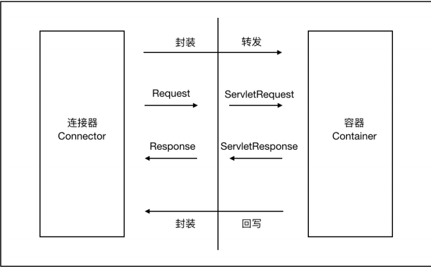

Tomcat支持多种应用层协议和I/O模型，如下：

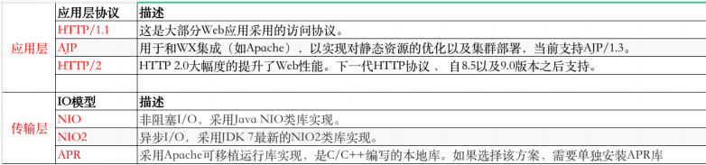

在 8.0 之前 ，Tomcat默认采用的I/O方式为 BIO，之后改为 NIO。无论 NIO、NIO2 还是 APR， 在性
能方面均优于以往的BIO。 如果采⽤APR， 甚至可以达到 Apache HTTP Server 的影响性能

#### Coyote内部组件及流程
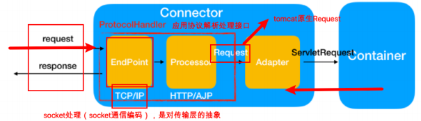

|  组件   | 描述  |
|  ----  | ----  |
| EndPoint  | EndPoint 是 Coyote 通信端点，即通信监听的接口，是具体Socket接收和发送处理器，是对传输层的抽象，因此EndPoint用来实现TCP/IP协议的 |
| Processor  | Processor 是Coyote 协议处理接⼝，Processor接收来自EndPoint的Socket，读取字节流解析成Tomcat Request和Response对象，并通过Adapter将其提交到容器处理，Processor是对应⽤层协议的抽象 |
| ProtocolHandler | Coyote 协议接⼝， 通过Endpoint 和 Processor ，实现针对具体协议的处理能力。Tomcat 按照协议和I/O 提供了6个实现类 ： AjpNioProtocol ，AjpAprProtocol， AjpNio2Protocol ， Http11NioProtocol ，Http11Nio2Protocol ，Http11AprProtocol|
| Adapter | 由于协议不同，客户端发过来的请求信息也不尽相同，Tomcat定义了自己的Request类来封装这些请求信息。ProtocolHandler接⼝负责解析请求并生成成Tomcat Request类。但是这个Request对象不是标准的ServletRequest，不能⽤Tomcat Request作为参数来调⽤容器。Tomcat设计者的解决⽅案是引CoyoteAdapter，这是适配器模式的经典运⽤，连接器调⽤CoyoteAdapter的Sevice⽅法，传⼊的是Tomcat Request对象，CoyoteAdapter负责将Tomcat Request转成ServletRequest，再调servlet容器 |

### Tomcat容器组件Catalina
> 从另一个角度来说，Tomcat本质上就是一款Servlet容器，因为Catalina才是Tomcat的核心，其
他模块都是为Catalina 提供支撑的。如：通过Coyote模块提供链接通信，Jasper 模块提供 JSP 引
擎，Naming提供JNDI服务，Juli 提供日志服务。

#### Catalina结构
Tomcat（我们往往有一个认识，Tomcat就是一个Catalina的实例，因为Catalina是Tomcat的核心） 

Tomcat/Catalina实例
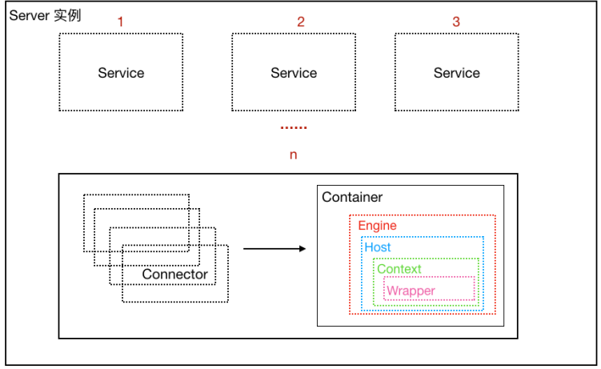

其实，可以认为整个Tomcat就是一个Catalina实例，Tomcat在启动的时候会初始化这个实例，Catalina
实例通过加载server.xml完成其他实例的创建，创建并管理多个Server，Server创建并管理多个服务，
每个服务又可以有多个Connector和一个Container。

一个Catalina实例（容器） -> 一个 Server实例（容器） -> 多个Service实例（容器） -> 每个Service实例下可以有多个Connector实例和一个Container实例

- Catalina

    负责解析Tomcat的配置文件（server.xml） , 以此来创建服务器Server组件并进行管理
- Server

    服务器表示整个Catalina Servlet容器以及其它组件，负责组装并启动Servlaet引擎,Tomcat连接
器。Server通过实现Lifecycle接⼝，提供了一种优雅的启动和关闭整个系统的方式
- Service

    服务是Server内部的组件，一个Server包含多个Service。它将若干个Connector组件绑定到一个Container
- Container

    容器，负责处理用户的servlet请求，并返回对象给web用户的模块
    
##### Container组件的具体结构
Container组件下有几种具体的组件，分别是Engine、Host、Context和Wrapper。这4种组件（容器）
是父子关系。Tomcat通过一种分层的架构，使得Servlet容器具有很好的灵活性

- Engine

    表示整个Catalina的Servlet引擎，用来管理多个虚拟站点，一个Service最多只能有一个Engine，但是一个引擎可包含多个Host
- Host

    代表一个虚拟主机，或者说一个站点，可以给Tomcat配置多个虚拟主机地址，一个虚拟主机下可包含多个Context
- Context
    表示一个Web应用程序，一个Web应用可包含多个Wrapper
- Wrapper
    表示一个Servlet，Wrapper作为容器中的最底层，不能包含字容器
    
`上述组件的配置其实就体现在conf/server.xml中`

## Tomcat源码分析
### 启动流程分析
#### 前置内容
这里就不逐行贴代码分析，大概分析几个关键点，先放出执行流程图

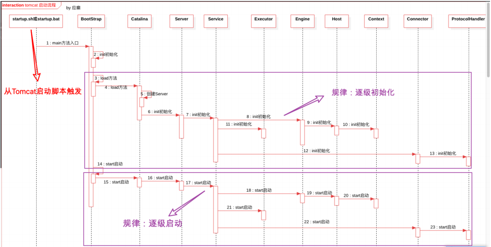

- org.apache.catalina.Lifecycle

    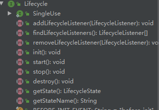
    
    LifeCycle规定了生命周期，可以看到里面的init，start，stop，destory等方法，容器大都实现了该接口
    
- org.apache.catalina.util.LifecycleBase#init

    LifecycleBase,容器都继承了该类，而该类实现了Lifecycle接口，对一些相同代码进行了复用，例如下面这个方法
```java
    public final synchronized void init() throws LifecycleException {
        if (!state.equals(LifecycleState.NEW)) {
            invalidTransition(Lifecycle.BEFORE_INIT_EVENT);
        }

        try {
            // 所有实现该类的init方法，先走到父类这里，设置一下属性值，在调用自己的init方法
            setStateInternal(LifecycleState.INITIALIZING, null, false);
            // 模板方法，StandServer，StandService......都会集成LifecycleBean，自己会对该方法复写
            initInternal();
            // 自己的方法执行完后，再设置一下属性值
            setStateInternal(LifecycleState.INITIALIZED, null, false);
        } catch (Throwable t) {
            handleSubClassException(t, "lifecycleBase.initFail", toString());
        }
    }
```

#### 源码分析
    从脚本启动过来之后，没啥看点，看流程图就可以了

### 请求流程分析
#### 前置内容

这里就不逐行贴代码分析，大概分析几个关键点，先放出执行流程图

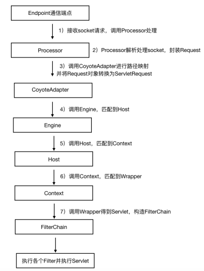

关键代码分析：
- org.apache.catalina.mapper.Mapper

    类结构如下：
    
    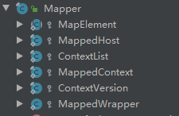
    
    Mapper中包含了MappedHost，MappedContext，MappedWrapper等内部类，完成URL和Host，context，wrapper等容器的映射
- org.apache.catalina.Pipeline分析 

    请求执行流程中多依赖Pipeline来向下传递执行，有点类似于通常说的过滤器的功能，先看结构图：
    
    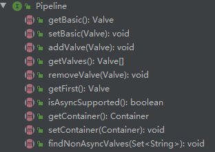
    
    虽然Pipeline并没有属性，但是根据getValue，getContainer等方法可以，其子类必定含有value，container属性
    
    container就是容器：Engine，host，context，wrapper等类
    
    value是具体干活的对象，例如StandContextValue
    
    先简单总结一下，pipeline中含有一个value对象，value对象本身类似于单项链表，含有一个next指针，pipeline调用addValue方法，就是一直在链表后边追加value的过程
    
    value本身可以通过getnext.invoke来达到链式执行下一个value的效果，或者只调用自己
    
    而在这里，一个容器对应一个pipeline，一个pipeline可以有一个链式value，会在后面的源码分析看到对应的调用过程

- org.apache.catalina.core.StandardPipeline分析,该类实现了Pipeline接口，大部分容器继承该类。主要看一下addValue方法
```java
public void addValve(Valve valve) {

    // Validate that we can add this Valve
    // 如果value是Contained类型，StandContextValue等都实现了Contained接口
    if (valve instanceof Contained)
        // 设置容器
        ((Contained) valve).setContainer(this.container);

    // Start the new component if necessary
    if (getState().isAvailable()) {
        // 如果实现了Lifecycle接口
        if (valve instanceof Lifecycle) {
            try {
                // 调用start方法，启动
                ((Lifecycle) valve).start();
            } catch (LifecycleException e) {
                log.error(sm.getString("standardPipeline.valve.start"), e);
            }
        }
    }

    // Add this Valve to the set associated with this Pipeline
    if (first == null) {
        // 如果first节点为空，则设置value到first节点，将basic设置为first之后，bisic节点相当于保底，获取First时，如果为空，则返回basic
        first = valve;
        valve.setNext(basic);
    } else {
        Valve current = first;
        while (current != null) {   
            // 将新增value放到basic之前，basic放到最后
            if (current.getNext() == basic) {
                current.setNext(valve);
                valve.setNext(basic);
                break;
            }
            current = current.getNext();
        }
    }
    
    // 触发容器监听
    container.fireContainerEvent(Container.ADD_VALVE_EVENT, valve);
}

// first节点为空，则返回basic
public Valve getFirst() {
    if (first != null) {
        return first;
    }

    return basic;
}
```
    可以看到，basic总是在最后一个
    
- org.apache.catalina.Valve

    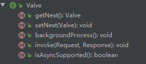
    
    value结构比较简单，主要就是设置下一个节点，以及执行方法
---
#### 源码分析

- org.apache.tomcat.util.net.NioEndpoint#startInternal
    这里其实是Endpoint的启动方法，此时将poller线程已经启动起来，后续的访问会走poller的run方法
```java
public void startInternal() throws Exception {
        // Start poller threads
        // NIO，就是异步IO，socket内容的读写是通过Poller来实现的，检查nio的selector是否准备好读和写。 nio的三种方式：select,poll,epoll,这里的poller是大概采用poll方式，
        // 因为poller实现了Runnable接口，所以它的run方法是比较核心的，用来处理请求
        pollers = new Poller[getPollerThreadCount()];
        for (int i=0; i<pollers.length; i++) {
            pollers[i] = new Poller();
            Thread pollerThread = new Thread(pollers[i], getName() + "-ClientPoller-"+i);
            pollerThread.setPriority(threadPriority);
            pollerThread.setDaemon(true);
            pollerThread.start();
        }
        // Acceptor的作用是控制与tomcat建立连接的数量，但Acceptor只负责建立连接。
        startAcceptorThreads();
    }
}
```
- org.apache.coyote.AbstractProtocol.ConnectionHandler#process
```java
    // 获取processor,第一次获取不到为空，下面进行创建
    Processor processor = connections.get(socket);
    // 创建processor
     processor = getProtocol().createProcessor();
    // 调用processor.process
     state = processor.process(wrapper, status);
```

- org.apache.coyote.http11.Http11Processor#service
```java
// 获取Coyote适配器，并执行service方法
getAdapter().service(request, response);
```

- org.apache.catalina.connector.CoyoteAdapter#service
```java
// 解析请求数据
 postParseSuccess = postParseRequest(req, request, res, response);
// 执行org.apache.catalina.core.StandardEngineValve#invoke
 connector.getService().getContainer().getPipeline().getFirst().invoke(
                        request, response);
```

- org.apache.catalina.core.StandardEngineValve#invoke
```java
// 执行 org.apache.catalina.core.StandardHostValve#invoke
host.getPipeline().getFirst().invoke(request, response);
```

- org.apache.catalina.core.StandardHostValve#invoke
```java
// 执行org.apache.catalina.core.StandardContextValve#invoke
context.getPipeline().getFirst().invoke(request, response);
```

- org.apache.catalina.core.StandardContextValve#invoke
```java
// 执行org.apache.catalina.core.StandardWrapperValve#invoke
 wrapper.getPipeline().getFirst().invoke(request, response);
```

- org.apache.catalina.core.StandardWrapperValve#invoke
```java
// 执行过滤器
filterChain.doFilter(request.getRequest(),response.getResponse());
```

- org.apache.catalina.core.ApplicationFilterChain#internalDoFilter
```java
// 执行servlet的service方法，到此已经找到对应servlet并执行
servlet.service(request, response);
```
---
## Tomcat类加载器

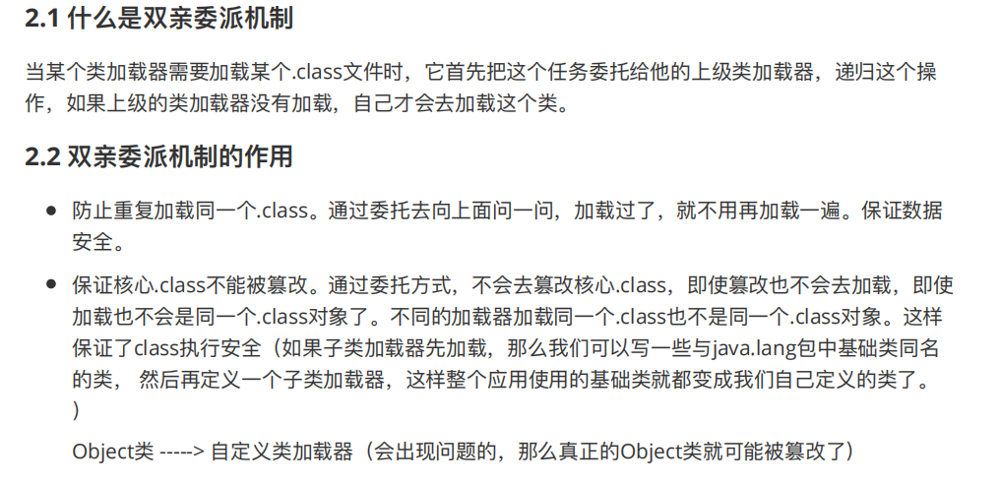

tomcat是可以部署多个服务的，如果有两个服务A，B有同名的类，那么用java原本的类加载器，A的类被加载后，B的类就不会被加载

所以tomcat有一个WebApp类加载器，每个应有都有自己的一个WebApp类加载器，互不影响

这里总结的比较简单，详细内容百度吧