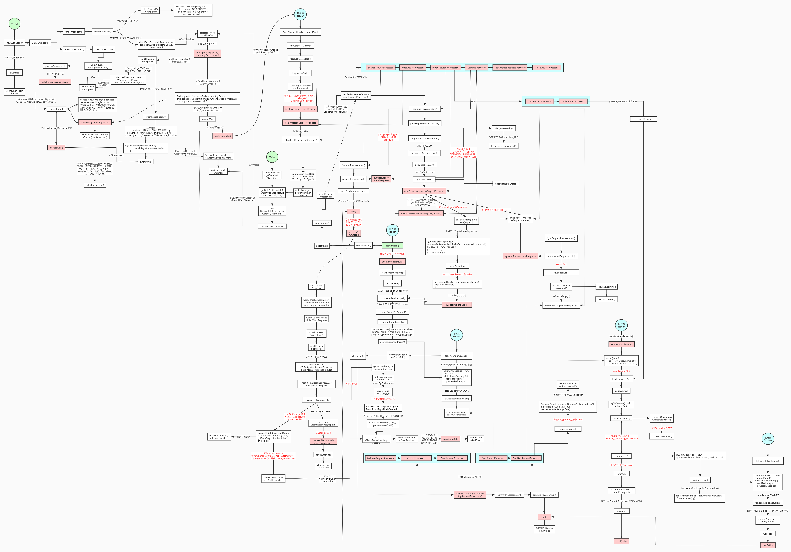
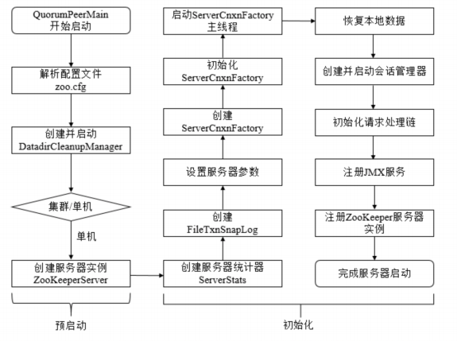
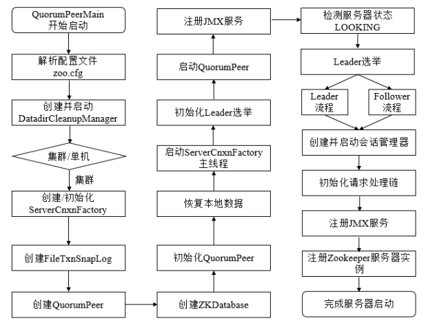
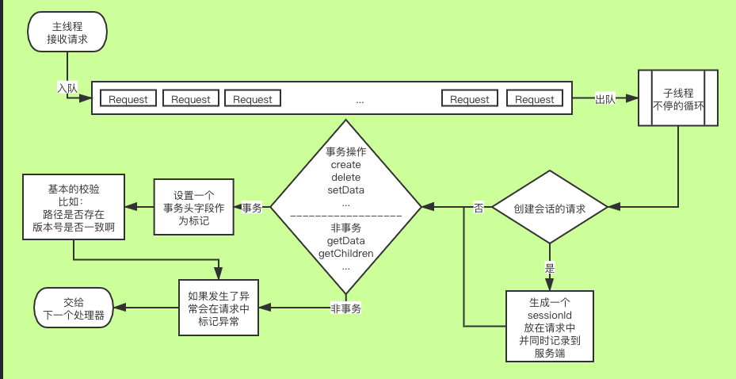
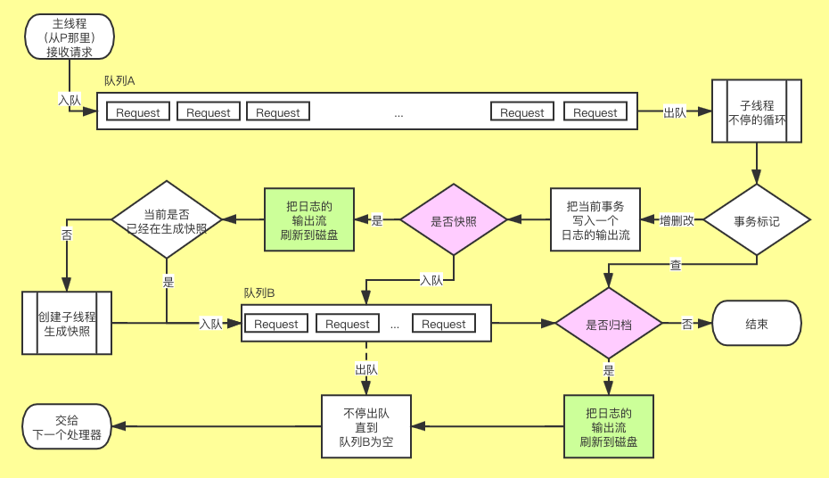
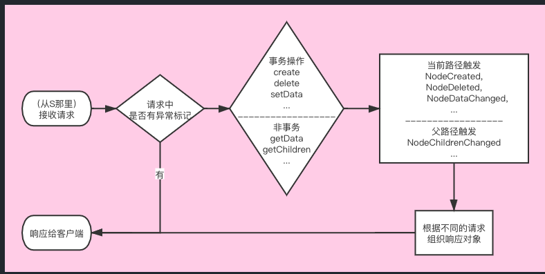
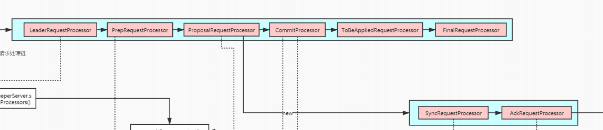
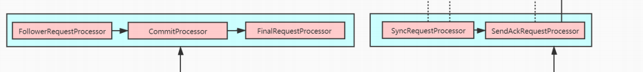
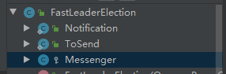
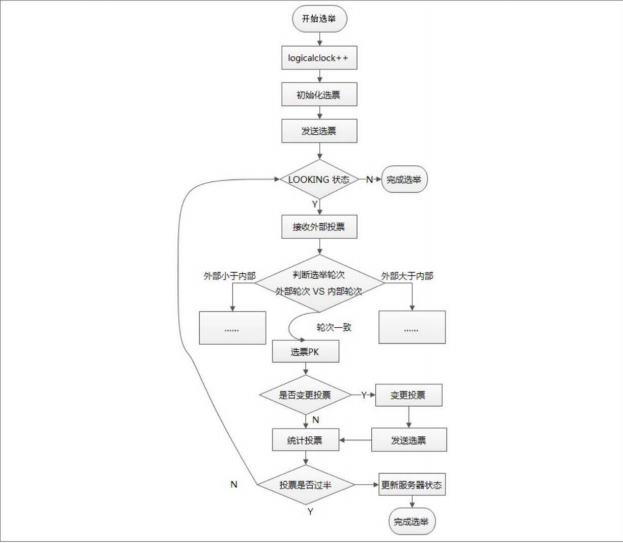

#内存模型
主要类如下：
- ZKDatabase 数据库类的封装
- FileTxnSnapLog 日志类封装，包括事务日志和Snapshot日志的管理
- SnapShot为Shapshot日志接口，FileSnap为具体实现类。
- TxnLog为事务日志接口，FileTxnLog为具体实现类。
- DataTree为节点数据管理类，负责保存节点的数据以及管理数据的Watcher。
- DataNode保存节点的数据信息，状态信息以及子节点信息。

可以简单划分为三个点：事务日志，快照文件，内存数据

流程：事务日志归档，如果需要出发快照文件，则将当前内存数据进行快照存储，然后更新内存数据。一般的操作都是基于内存的

既然有了事务日志，为什么还需要快照文件？是为了方便恢复数据的

```java
  public class DataTree {  
    private final ConcurrentHashMap<String, DataNode> nodes =   new ConcurrentHashMap<String, DataNode>();   
    // watcher回调数据集合 
    private final WatchManager dataWatches = new WatchManager();
    // 节点数据   
    private final WatchManager childWatches = new WatchManager();
    
    //...
  }
```

参考：
- https://mp.weixin.qq.com/s?__biz=MzA4ODIyMzEwMg==&mid=2447536030&idx=1&sn=392047c81020859ff399944a9e20ef8d&chksm=843bb38fb34c3a994ee5768cc9991420f9c99acd140a1e2ea722a37b56c42696a432b01e919b&scene=21#wechat_redirect
# 客户端
## 源码分析
流程图参考下图的客户端部分



主要概念：
- sendThread：负责跟服务端建立IO链接，并处理读写请求的线程
- eventThread：事件处理线程，watcher的回调就是在这处理。也是从队列中获取消息
- outgoingQueue：等待发送的消息队列，sendThread从该消息队列获取数据
- pendingQueue：等待服务器返回队列，从outgoingQueue拿到请求处理完之后，不是连接事件，不是ping事件，不是认证事件，移到该队列
- 读请求：sendThread接收到服务端的请求，如果该请求存在于pendingqueue中，则从该队列移除。如果有对应监听的话，生成监听事件，放入监听队列，等待eventThread处理
- 写请求：sendThread往服务端发送的请求

主要流程：
1. 客户端启动时，会启动sendThread和eventThread，代码如下：

客户端启动入口：org.apache.zookeeper.ZooKeeperMain.main，点击zookeeperMain构造芳芳一直往下，可以看到关键代码
org.apache.zookeeper.ClientCnxn.start
```java
public void start() {
        // sendThread线程启动
        sendThread.start();
        // eventThread线程启动
        eventThread.start();
    }
```
2. 客户端命令输入请求,以create为例，方法入口org.apache.zookeeper.ZooKeeper.create(java.lang.String, byte[], java.util.List<org.apache.zookeeper.data.ACL>, org.apache.zookeeper.CreateMode)
往下点击，会找到org.apache.zookeeper.ClientCnxn.submitRequest(org.apache.zookeeper.proto.RequestHeader, org.apache.jute.Record, org.apache.jute.Record, org.apache.zookeeper.ZooKeeper.WatchRegistration, org.apache.zookeeper.WatchDeregistration)方法
```java
    public ReplyHeader submitRequest(RequestHeader h, Record request,
            Record response, WatchRegistration watchRegistration,
            WatchDeregistration watchDeregistration)
            throws InterruptedException {
        ReplyHeader r = new ReplyHeader();
        // 这里点进去看的话就是将packet加入到outgoingqueue，触发写事件并返回，等待sendThread线程处理
        Packet packet = queuePacket(h, r, request, response, null, null, null,
                null, watchRegistration, watchDeregistration);
        // 线程进行等待，超时时间>0就设置超时时间，否则一直等待，直到客户端返回之后，该线程会被唤醒
        synchronized (packet) {
            if (requestTimeout > 0) {
                // Wait for request completion with timeout
                waitForPacketFinish(r, packet);
            } else {
                // Wait for request completion infinitely
                while (!packet.finished) {
                    packet.wait();
                }
            }
        }
        if (r.getErr() == Code.REQUESTTIMEOUT.intValue()) {
            sendThread.cleanAndNotifyState();
        }
        // 返回客户端命令请求结果
        return r;
    }
```
3. sendThread写请求处理，org.apache.zookeeper.ClientCnxn.SendThread.run -> org.apache.zookeeper.ClientCnxnSocketNIO.doTransport -> org.apache.zookeeper.ClientCnxnSocketNIO.doIO
```java
    void doIO(List<Packet> pendingQueue, ClientCnxn cnxn)
      throws InterruptedException, IOException {
        SocketChannel sock = (SocketChannel) sockKey.channel();
        if (sock == null) {
            throw new IOException("Socket is null!");
        }
        // 读请求，读取服务端返回信息
        if (sockKey.isReadable()) {
        .......
                    // 进这个方法
                    sendThread.readResponse(incomingBuffer);
                    lenBuffer.clear();
                    incomingBuffer = lenBuffer;
                    updateLastHeard();
                }
            }
        }
        // 写请求，向服务端写数据
        if (sockKey.isWritable()) {
            // 从outgoingqueue拿数据
            Packet p = findSendablePacket(outgoingQueue,
                    sendThread.tunnelAuthInProgress());
            ........
        }
    }
```

org.apache.zookeeper.ClientCnxn.SendThread.readResponse
```java
        void readResponse(ByteBuffer incomingBuffer) throws IOException {
            ByteBufferInputStream bbis = new ByteBufferInputStream(
                    incomingBuffer);
            BinaryInputArchive bbia = BinaryInputArchive.getArchive(bbis);
            ReplyHeader replyHdr = new ReplyHeader();
            //..... 省略一些分支代码
            if (replyHdr.getXid() == -1) {// 服务端数据变动事件，需要向watchingevent队列中放入，等待eventthread消费
                // -1 means notification
                if (LOG.isDebugEnabled()) {
                    LOG.debug("Got notification sessionid:0x"
                        + Long.toHexString(sessionId));
                }
                WatcherEvent event = new WatcherEvent();
                event.deserialize(bbia, "response");

                // convert from a server path to a client path
                if (chrootPath != null) {
                    String serverPath = event.getPath();
                    if(serverPath.compareTo(chrootPath)==0)
                        event.setPath("/");
                    else if (serverPath.length() > chrootPath.length())
                        event.setPath(serverPath.substring(chrootPath.length()));
                    else {
                    	LOG.warn("Got server path " + event.getPath()
                    			+ " which is too short for chroot path "
                    			+ chrootPath);
                    }
                }

                WatchedEvent we = new WatchedEvent(event);
                if (LOG.isDebugEnabled()) {
                    LOG.debug("Got " + we + " for sessionid 0x"
                            + Long.toHexString(sessionId));
                }

                eventThread.queueEvent( we );
                return;
            }
            Packet packet;
            synchronized (pendingQueue) {
                // 从pendingQueue取数据，取不到报错
                if (pendingQueue.size() == 0) {
                    throw new IOException("Nothing in the queue, but got "
                            + replyHdr.getXid());
                }
                packet = pendingQueue.remove();
            }
            /*
             * Since requests are processed in order, we better get a response
             * to the first request!
             */
            try {
                if (packet.requestHeader.getXid() != replyHdr.getXid()) {
                    packet.replyHeader.setErr(
                            KeeperException.Code.CONNECTIONLOSS.intValue());
                    throw new IOException("Xid out of order. Got Xid "
                            + replyHdr.getXid() + " with err " +
                            + replyHdr.getErr() +
                            " expected Xid "
                            + packet.requestHeader.getXid()
                            + " for a packet with details: "
                            + packet );
                }

                packet.replyHeader.setXid(replyHdr.getXid());
                packet.replyHeader.setErr(replyHdr.getErr());
                packet.replyHeader.setZxid(replyHdr.getZxid());
                if (replyHdr.getZxid() > 0) {
                    lastZxid = replyHdr.getZxid();
                }
                if (packet.response != null && replyHdr.getErr() == 0) {
                    packet.response.deserialize(bbia, "response");
                }

                if (LOG.isDebugEnabled()) {
                    LOG.debug("Reading reply sessionid:0x"
                            + Long.toHexString(sessionId) + ", packet:: " + packet);
                }
            } finally {
                // 响应结束，唤醒packet阻塞的线程，返回结果
                finishPacket(packet);
            }
        }
```

参考：
- https://blog.csdn.net/kingmax54212008/article/details/80077018

# 服务端
- 服务端的几个RequestProcesser比较关键，通过责任链模式执行，所有RequestProcesser不是同一个线程的
## 单机启动流程
参考下图，流程比较简单，暂时不做源码分析记录


## 集群启动流程
参考下面这个图，包含了启动流程和领导选举过程，要结合代码看，直接看图会蒙的


.jpg)

# 一致性
参考下图


## 前置概念：
- RequestProcessor，zk采用责任链模式，不同的processor分工不同，所有的processor并不在一个线程上，可能并行执行
- PrepRequestProcessor:负责预处理



从流程上可以看到，PrepRequestProcessor 不涉及内存的操作和文件的操作，主要负责做些校验和标记的任务。
- ProposalRequestProcessor：负责写事务的提案

1.异步提交给CommitProcessor来处理<br>
2.如果是写操作者进行下面的操作<br>
    向所有的Follower发送这个写request的proposal<br>
    把请求发送给SyncRequestProcessor来处理<br>
    
- CommitRequestProcessor：负责对事物请求提交
（leader）记录下来那个事务待归档，然后阻塞，等待自身归档之后，删除待归档记录，提交事务

- SyncRequestProcessor：负责数据的归档



是否快照：事务记录的数量或者大小大于了某一个程度，而这个程度的数字则是一个随机数（每次快照完都会重置）<br>
是否归档：上次归档的时间和当前时间是否超过了配置的间隔时间（默认该配置为 0），或者事务的记录超过了配置的数量（默认为 1000）<br>
使用了这两个判断控制了快照和归档的频率：<br>
频率低的话，一次写入更多数据到磁盘，性能更好，但是容灾能力就低<br>
频率高的话，对性能会有一定影响，但是容灾能力强<br>

- AckRequestProcessor：leader节点负责当前节点的事务ACK通讯
不仅通知其他节点，也会通知自身节点（例如归档完成）

- SendRequestProcessor：leader节点负责当前节点的事务ACK通讯

- FInalRequestProcessor：负责对内存模型的操作,并响应客户端


- LeaderRequestProcessor ：leder服务端的第一个处理器
- FollowerRequestProcessor ：leder服务端的第一个处理器
- ToBeAppliedRequestProcessor：作用不大

### 单机版本的执行链
- p -> s -> f
### 集群版本leader节点执行链


这里为什么分两部分呢？<br>
因为归档和通知是异步的，另一个线程，follower节点同理
### 集群版本follower节点执行链


这里为什么分为两部分呢，是这样的<br>
读请求：fw -> c -> f 返回<br>
读请求: 需要转发给服务端，服务端归档数据时会通知follower，follower直接sync归档，然后sa通知服务端，服务端提交事务时通知follower提交，fw -> c -> f

## requestProcesser的构建代码
### leader节点
该方法构建责任链：org.apache.zookeeper.server.quorum.LeaderZooKeeperServer.setupRequestProcessors
```java
    protected void setupRequestProcessors() {
        RequestProcessor finalProcessor = new FinalRequestProcessor(this);
        RequestProcessor toBeAppliedProcessor = new Leader.ToBeAppliedRequestProcessor(finalProcessor, getLeader());
        commitProcessor = new CommitProcessor(toBeAppliedProcessor,
                Long.toString(getServerId()), false,
                getZooKeeperServerListener());
        // 可以看到 c -> tobe -> f是一个线程
        commitProcessor.start();
        ProposalRequestProcessor proposalProcessor = new ProposalRequestProcessor(this,
                commitProcessor);
        // 这个方法启动了syncRequestProcessor线程
        proposalProcessor.initialize();
        
        // prepRequestProcessor 是一个线程
        prepRequestProcessor = new PrepRequestProcessor(this, proposalProcessor);
        prepRequestProcessor.start();
        firstProcessor = new LeaderRequestProcessor(this, prepRequestProcessor);

        setupContainerManager();
    }
```

### follower节点
org.apache.zookeeper.server.quorum.FollowerZooKeeperServer.setupRequestProcessors

```java
    protected void setupRequestProcessors() {
        RequestProcessor finalProcessor = new FinalRequestProcessor(this);
        commitProcessor = new CommitProcessor(finalProcessor,
                Long.toString(getServerId()), true, getZooKeeperServerListener());
        // c -> f一个线程
        commitProcessor.start();
        // fl一个线程
        firstProcessor = new FollowerRequestProcessor(this, commitProcessor);
        ((FollowerRequestProcessor) firstProcessor).start();
        // s -> sa 一个线程
        syncProcessor = new SyncRequestProcessor(this,
                new SendAckRequestProcessor((Learner)getFollower()));
        syncProcessor.start();
    }
```

### 各个RequestProcessor源码分析
- org.apache.zookeeper.server.quorum.LeaderRequestProcessor.processRequest
```java
    @Override
    public void processRequest(Request request)
            throws RequestProcessorException {
        // Check if this is a local session and we are trying to create
        // an ephemeral node, in which case we upgrade the session
        // 检查会话是否过期，去创建一个临时节点。如果失败那么就抛出异常。 TODO 不太准确
        Request upgradeRequest = null;
        try {
            upgradeRequest = lzks.checkUpgradeSession(request);
        } catch (KeeperException ke) {
            if (request.getHdr() != null) {
                LOG.debug("Updating header");
                request.getHdr().setType(OpCode.error);
                request.setTxn(new ErrorTxn(ke.code().intValue()));
            }
            request.setException(ke);
            LOG.info("Error creating upgrade request " + ke.getMessage());
        } catch (IOException ie) {
            LOG.error("Unexpected error in upgrade", ie);
        }
        if (upgradeRequest != null) {
            nextProcessor.processRequest(upgradeRequest);
        }

        nextProcessor.processRequest(request);
    }
```
- org.apache.zookeeper.server.PrepRequestProcessor
该类是继承了Thread的，开启单独线程处理<br>
```java
// 向队列submittedRequests添加一个请求,具体的处理在run方法中
public void processRequest(Request request) {
        submittedRequests.add(request);
    }
```

```java
    public void run() {
        try {
            while (true) {
                //从队列中取数据
            }
                Request request = submittedRequests.take();
                ......
                // 主要的处理逻辑，主要作用是前置操作：
                //主要作用是session检测，参数检查，权限鉴定，然后对事务请求加上TxnHeader这个事务头信息，以及txn这个事务操作的参数信息，
                // 并且其会维护一个changeRecord的缓存用于存储正在进行处理，但是命令还没执行完成的请求的处理操作。
                // 具体代码就不看了比较多
                pRequest(request);
            }
            ......
        LOG.info("PrepRequestProcessor exited loop!");
    }
```
- org.apache.zookeeper.server.quorum.ProposalRequestProcessor.processRequest

这个处理器主要处理的操作是对于follower发过来的sync的请求，直接委托给leader进行处理，而对于其他的请求先直接走到commitProcessor,<br>
而对于事务请求，会把投票发送给follower,并且将请求加入到SynRequestProcessor这条链去进行日志的记录以及投票的相关的操作。<br>
`需要注意的是这里的processRequest操作主要是没有用新的线程来操作的，所以此处的操作是PreRequestProcessor线程中进行的。`
```java

public void processRequest(Request request) throws RequestProcessorException {
    if(request instanceof LearnerSyncRequest){//这里处理的是follower发送来的sync操作
        zks.getLeader().processSync((LearnerSyncRequest)request);
    } else {
            //走到commitProcessor,具体操作是向queuedRequest添加请求，然后唤醒commitProcessor等待的线程去消费，同时这边往下走
            nextProcessor.processRequest(request);
        if (request.hdr != null) {//
            try {
                给follower发送PROPOSAL让follower进行日志存储和投票，也是丢到一个队列里，让另外的线程去消费，同时这边往下走
                zks.getLeader().propose(request);//
            } catch (XidRolloverException e) {
                throw new RequestProcessorException(e.getMessage(), e);
            }
            //本地走到SyncRequestProcessor去进行日志的存储工作，也就是说这个方法采用异步方式基本同时干了三件事
            syncProcessor.processRequest(request);
        }
    }
}
```
- org.apache.zookeeper.server.quorum.CommitProcessor.run
```java
    public void run() {
        Request request;
        try {
            while (!stopped) {
                synchronized(this) {
                    while (
                        !stopped &&
                        // queuedRequests 从proposal过来的请求，此时queuedRequests不为空，不会wait，往下走
                        // 但是committedRequests实在sync同步之后，并通过ack通知leader之后并且判断通过了盘数提交，才会被赋值
                        // 所以处理完queuedRequests之后，会隔上一段时间才能处理对应的，中间可能会处理其他的请求，具体逻辑看下面这个条件判断
                        ((queuedRequests.isEmpty() || isWaitingForCommit() || isProcessingCommit()) &&
                         (committedRequests.isEmpty() || isProcessingRequest()))) {
                        wait();
                    }
                }

                /*
                 * Processing queuedRequests: Process the next requests until we
                 * find one for which we need to wait for a commit. We cannot
                 * process a read request while we are processing write request.
                 */
                while (!stopped && !isWaitingForCommit() &&
                       !isProcessingCommit() &&
                       (request = queuedRequests.poll()) != null) {
                    // 需要事务提交
                    if (needCommit(request)) {
                    // 待处理事务
                        nextPending.set(request);
                    } else {
                        sendToNextProcessor(request);
                    }
                }

                /*
                 * Processing committedRequests: check and see if the commit
                 * came in for the pending request. We can only commit a
                 * request when there is no other request being processed.
                 */
                // 提交请求
                processCommitted();
            }
        } catch (Throwable e) {
            handleException(this.getName(), e);
        }
        LOG.info("CommitProcessor exited loop!");
    }

    protected void processCommitted() {
        Request request;
        // committedRequests有值得时候才能往下走，而只有过半提交之后committedRequests才会被赋值
        if (!stopped && !isProcessingRequest() &&
                (committedRequests.peek() != null)) {

            /*
             * ZOOKEEPER-1863: continue only if there is no new request
             * waiting in queuedRequests or it is waiting for a
             * commit. 
             */
            if ( !isWaitingForCommit() && !queuedRequests.isEmpty()) {
                return;
            }
            request = committedRequests.poll();

            /*
             * We match with nextPending so that we can move to the
             * next request when it is committed. We also want to
             * use nextPending because it has the cnxn member set
             * properly.
             */
            Request pending = nextPending.get();
            if (pending != null &&
                pending.sessionId == request.sessionId &&
                pending.cxid == request.cxid) {
                // we want to send our version of the request.
                // the pointer to the connection in the request
                pending.setHdr(request.getHdr());
                pending.setTxn(request.getTxn());
                pending.zxid = request.zxid;
                // Set currentlyCommitting so we will block until this
                // completes. Cleared by CommitWorkRequest after
                // nextProcessor returns.
                currentlyCommitting.set(pending);
                nextPending.set(null);
                // 交给另一个线程处理了，并不是下一个FInalprocessor，而是CommitWorkRequest
                sendToNextProcessor(pending);
            } else {
                // this request came from someone else so just
                // send the commit packet
                currentlyCommitting.set(request);
                sendToNextProcessor(request);
            }
        }      
    }

    // org.apache.zookeeper.server.quorum.CommitProcessor.CommitWorkRequest.doWork
        public void doWork() throws RequestProcessorException {
            try {
                // 调用finalProcessor
                nextProcessor.processRequest(request);
            } finally {
                // If this request is the commit request that was blocking
                // the processor, clear.
                // 重置状态值
                currentlyCommitting.compareAndSet(request, null);

                /*
                 * Decrement outstanding request count. The processor may be
                 * blocked at the moment because it is waiting for the pipeline
                 * to drain. In that case, wake it up if there are pending
                 * requests.
                 */
                if (numRequestsProcessing.decrementAndGet() == 0) {
                    if (!queuedRequests.isEmpty() ||
                        !committedRequests.isEmpty()) {
                        wakeup();
                    }
                }
            }
        }
```

-  org.apache.zookeeper.server.SyncRequestProcessor.flush

SyncRequestProcessor的run方法主要是归档和判断要不要做内存快照，最后会调到这里
```java
    private void flush(LinkedList<Request> toFlush)
        throws IOException, RequestProcessorException
    {
        if (toFlush.isEmpty())
            return;
        // 归档
        zks.getZKDatabase().commit();
        while (!toFlush.isEmpty()) {
            Request i = toFlush.remove();
            if (nextProcessor != null) {
                // 调用ack通知
                nextProcessor.processRequest(i);
            }
        }
        if (nextProcessor != null && nextProcessor instanceof Flushable) {
            ((Flushable)nextProcessor).flush();
        }
    }
```

- org.apache.zookeeper.server.quorum.AckRequestProcessor.processRequest
```java
    public void processRequest(Request request) {
        QuorumPeer self = leader.self;
        if(self != null)
            // 调用该方法
            leader.processAck(self.getId(), request.zxid, null);
        else
            LOG.error("Null QuorumPeer");
    }
```

- org.apache.zookeeper.server.quorum.Leader.tryToCommit

针对事务提交操作来说，leader.processAck会进入这里
```java
synchronized public boolean tryToCommit(Proposal p, long zxid, SocketAddress followerAddr) {       
       // make sure that ops are committed in order. With reconfigurations it is now possible
       // that different operations wait for different sets of acks, and we still want to enforce
       // that they are committed in order. Currently we only permit one outstanding reconfiguration
       // such that the reconfiguration and subsequent outstanding ops proposed while the reconfig is
       // pending all wait for a quorum of old and new config, so it's not possible to get enough acks
       // for an operation without getting enough acks for preceding ops. But in the future if multiple
       // concurrent reconfigs are allowed, this can happen.
       if (outstandingProposals.containsKey(zxid - 1)) return false;
       
       // in order to be committed, a proposal must be accepted by a quorum.
       //
       // getting a quorum from all necessary configurations.
        // 判断有没有半数归档
        if (!p.hasAllQuorums()) {
           return false;                 
        }
        
        // commit proposals in order
        if (zxid != lastCommitted+1) {    
           LOG.warn("Commiting zxid 0x" + Long.toHexString(zxid)
                    + " from " + followerAddr + " not first!");
            LOG.warn("First is "
                    + (lastCommitted+1));
        }     
        
        outstandingProposals.remove(zxid);
        
        if (p.request != null) {
             toBeApplied.add(p);
        }

        if (p.request == null) {
            LOG.warn("Going to commmit null: " + p);
        } else if (p.request.getHdr().getType() == OpCode.reconfig) {                                   
            LOG.debug("Committing a reconfiguration! " + outstandingProposals.size()); 
                 
            //if this server is voter in new config with the same quorum address, 
            //then it will remain the leader
            //otherwise an up-to-date follower will be designated as leader. This saves
            //leader election time, unless the designated leader fails                             
            Long designatedLeader = getDesignatedLeader(p, zxid);
            //LOG.warn("designated leader is: " + designatedLeader);

            QuorumVerifier newQV = p.qvAcksetPairs.get(p.qvAcksetPairs.size()-1).getQuorumVerifier();
       
            self.processReconfig(newQV, designatedLeader, zk.getZxid(), true);

            if (designatedLeader != self.getId()) {
                allowedToCommit = false;
            }
                   
            // we're sending the designated leader, and if the leader is changing the followers are 
            // responsible for closing the connection - this way we are sure that at least a majority of them 
            // receive the commit message.
            commitAndActivate(zxid, designatedLeader);
            informAndActivate(p, designatedLeader);
            //turnOffFollowers();
        } else {
            // 已半数归档，通知各个节点进行commit
            commit(zxid);
            // 通知observe类型节点
            inform(p);
        }
        // 这个方法会在commitProcessor放入request，同时唤醒commitProcessor线程，这里就和上边分析commitProcessor对上了
        zk.commitProcessor.commit(p.request);
        if(pendingSyncs.containsKey(zxid)){
            for(LearnerSyncRequest r: pendingSyncs.remove(zxid)) {
                sendSync(r);
            }               
        } 
        
        return  true;   
    }
```

- org.apache.zookeeper.server.FinalRequestProcessor的processRequest代码有点多，暂时不看了，主要作用是在事务提交之后，将数据更新到内存中，还有触发监听，
响应客户端等等操作
参考：
- https://github.com/HelloGitHub-Team/HelloZooKeeper/blob/main/content/5/content.md
- https://blog.csdn.net/cq_pf/article/details/108827761
- https://www.cnblogs.com/yougewe/p/11807390.html#_label4
# 领导选举

首先了解几个概念：
- 外部投票：特指其他服务器发来的投票。
- 内部投票：服务器⾃身当前的投票。
- 选举轮次：ZooKeeper服务器Leader选举的轮次，即logical clock（逻辑时钟）。
- PK：指对内部投票和外部投票进⾏⼀个对⽐来确定是否需要变更内部投票。选票管理
- sendqueue：选票发送队列，⽤于保存待发送的选票。
- recvqueue：选票接收队列，⽤于保存接收到的外部投票

选举类：父类，目前官方推荐的是org.apache.zookeeper.server.quorum.FastLeaderElection选举算法
```java
public interface Election {
    public Vote lookForLeader() throws InterruptedException;
    public void shutdown();
}
```
FastLeaderElection 有三个内部类



- Notification：其他服务器发过来的投票信息
- ToSend：发送给其他节点的投票信息
- Messager：包含两个子类WorkReceiver，WorkSender用来收发信息

的流程可以结合下图来看



org.apache.zookeeper.server.quorum.FastLeaderElection.lookForLeader
```java
public Vote lookForLeader() throws InterruptedException {
synchronized(this){
 // ⾸1. 先会将逻辑时钟⾃增，每进⾏⼀轮新的leader选举，都需要更新逻辑时钟
 logicalclock++;
 // 2. 更新选票（初始化选票）
 updateProposal(getInitId(), getInitLastLoggedZxid(),
getPeerEpoch());
 }
 LOG.info("New election. My id = " + self.getId() +
 ", proposed zxid=0x" + Long.toHexString(proposedZxid));
 // 3.向其他服务器发送已更新的选票（已更新的选票）
 sendNotifications();
```
这个发送信息可以点击去代码看一下，就是把信息放到了sendQueue中，然后由上边提到的sendWorker去发送

接收投票信息，org.apache.zookeeper.server.quorum.FastLeaderElection.lookForLeader
```java
 // 从recvqueue接收队列中取出投票
 Notification n = recvqueue.poll(notTimeout,
 TimeUnit.MILLISECONDS);
 /*
 * Sends more notifications if haven't received enough.
 * Otherwise processes new notification.
 */
 if(n == null){ // ⽆法获取选票
 if(manager.haveDelivered()){ // manager已经发送了所有选票消息
（表示有连接）
 // 向所有其他服务器发送消息
 sendNotifications();
 } else { // 还未发送所有消息（表示⽆连接）
 // 连接其他每个服务器
 manager.connectAll();
 }
 /*
 * Exponential backoff
 */
 int tmpTimeOut = notTimeout*2;
 notTimeout = (tmpTimeOut < maxNotificationInterval?
 tmpTimeOut : maxNotificationInterval);
 LOG.info("Notification time out: " + notTimeout);
 }
```
进行投票pk,这里可以看到有looking，OBSERVING，FOLLOWING，LEADING等几个状态，这里主要看LOOKING逻辑，如果服务启动时处于其他
几种状态，不用进行领导选举
```java
case LOOKING:
                        // If notification > current, replace and send messages out
                        if (n.electionEpoch > logicalclock.get()) { // 如果外部投票轮粗大于自身轮次
                            // 重置自身轮次为外部轮次
                            logicalclock.set(n.electionEpoch);
                            // 清空所有接收到的选票
                            recvset.clear();
                            // 进行pk
                            if(totalOrderPredicate(n.leader, n.zxid, n.peerEpoch,
                                    getInitId(), getInitLastLoggedZxid(), getPeerEpoch())) {
                            // 如果外部投票生出，更新选票信息为最终投票
                                updateProposal(n.leader, n.zxid, n.peerEpoch);
                            } else {
                            // 更新自己信息为最终投票
                                updateProposal(getInitId(),
                                        getInitLastLoggedZxid(),
                                        getPeerEpoch());
                            }
                            // 发送本服务器的内部选票信息
                            sendNotifications();
                        } else if (n.electionEpoch < logicalclock.get()) {// 如果外部轮次小于自身轮次，不做处理
                            if(LOG.isDebugEnabled()){
                                LOG.debug("Notification election epoch is smaller than logicalclock. n.electionEpoch = 0x"
                                        + Long.toHexString(n.electionEpoch)
                                        + ", logicalclock=0x" + Long.toHexString(logicalclock.get()));
                            }
                            break;
                        } else if (totalOrderPredicate(n.leader, n.zxid, n.peerEpoch,
                                proposedLeader, proposedZxid, proposedEpoch)) {// 如果轮次相等，进行pk，然后更新数据
                            updateProposal(n.leader, n.zxid, n.peerEpoch);
                            sendNotifications();
                        }

                        if(LOG.isDebugEnabled()){
                            LOG.debug("Adding vote: from=" + n.sid +
                                    ", proposed leader=" + n.leader +
                                    ", proposed zxid=0x" + Long.toHexString(n.zxid) +
                                    ", proposed election epoch=0x" + Long.toHexString(n.electionEpoch));
                        }

                        // don't care about the version if it's in LOOKING state
                        // 记录当前服务器在本轮次的leader选举中收到的所有外部投票
                        recvset.put(n.sid, new Vote(n.leader, n.zxid, n.electionEpoch, n.peerEpoch));
            
                        // 判断当前节点收到的选票能否结束选举
                        if (termPredicate(recvset,
                                new Vote(proposedLeader, proposedZxid,
                                        logicalclock.get(), proposedEpoch))) {

                            // Verify if there is any change in the proposed leader
                            while((n = recvqueue.poll(finalizeWait,
                                    TimeUnit.MILLISECONDS)) != null){// 遍历所有选票
                             // 选票有变更，⽐之前提议的Leader有更好的选票加入
                                if(totalOrderPredicate(n.leader, n.zxid, n.peerEpoch,
                                        proposedLeader, proposedZxid, proposedEpoch)){
                                    // 将更优的选票放在recvqueue中
                                    recvqueue.put(n);
                                    break;
                                }
                            }

                            /*
                             * This predicate is true once we don't read any new
                             * relevant message from the reception queue
                             */
                            if (n == null) {  // 表示之前提议的Leader已经是最优的
                                // 设置服务器状态
                                self.setPeerState((proposedLeader == self.getId()) ?
                                        ServerState.LEADING: learningState());
                                // 最终的选票
                                Vote endVote = new Vote(proposedLeader,
                                        proposedZxid, logicalclock.get(), 
                                        proposedEpoch);
                                // 清空recvqueue队列的选票
                                leaveInstance(endVote);
                                // 返回选票
                                return endVote;
                            }
                        }
                        break;
                    case OBSERVING:
                        LOG.debug("Notification from observer: " + n.sid);
                        break;
                    case FOLLOWING:
                    case LEADING:
```

选票pk，方法，org.apache.zookeeper.server.quorum.FastLeaderElection.totalOrderPredicate
```java
    protected boolean totalOrderPredicate(long newId, long newZxid, long newEpoch, long curId, long curZxid, long curEpoch) {
        LOG.debug("id: " + newId + ", proposed id: " + curId + ", zxid: 0x" +
                Long.toHexString(newZxid) + ", proposed zxid: 0x" + Long.toHexString(curZxid));
        if(self.getQuorumVerifier().getWeight(newId) == 0){
            return false;
        }

        /*
         * We return true if one of the following three cases hold:
         * 1- New epoch is higher
         * 2- New epoch is the same as current epoch, but new zxid is higher
         * 3- New epoch is the same as current epoch, new zxid is the same
         *  as current zxid, but server id is higher.
         */

        return ((newEpoch > curEpoch) ||
                ((newEpoch == curEpoch) &&
                ((newZxid > curZxid) || ((newZxid == curZxid) && (newId > curId)))));
    }
```

是否能结束选举方法，就是看有没有过半的投票,org.apache.zookeeper.server.quorum.FastLeaderElection.termPredicate
```java
    protected boolean termPredicate(Map<Long, Vote> votes, Vote vote) {
        SyncedLearnerTracker voteSet = new SyncedLearnerTracker();
        voteSet.addQuorumVerifier(self.getQuorumVerifier());
        if (self.getLastSeenQuorumVerifier() != null
                && self.getLastSeenQuorumVerifier().getVersion() > self
                        .getQuorumVerifier().getVersion()) {
            voteSet.addQuorumVerifier(self.getLastSeenQuorumVerifier());
        }

        /*
         * First make the views consistent. Sometimes peers will have different
         * zxids for a server depending on timing.
         */
        for (Map.Entry<Long, Vote> entry : votes.entrySet()) {
            if (vote.equals(entry.getValue())) {
                voteSet.addAck(entry.getKey());
            }
        }

        return voteSet.hasAllQuorums();
    }
```

调用领导选举方法的一个地方,org.apache.zookeeper.server.quorum.QuorumPeer.run
```java
//  死循环，这里只分析looking分支
 while (running) {
                switch (getPeerState()) {
                case LOOKING:
                    LOG.info("LOOKING");

                    if (Boolean.getBoolean("readonlymode.enabled")) {
                        LOG.info("Attempting to start ReadOnlyZooKeeperServer");

                        // Create read-only server but don't start it immediately
                        final ReadOnlyZooKeeperServer roZk =
                            new ReadOnlyZooKeeperServer(logFactory, this, this.zkDb);
    
                        // Instead of starting roZk immediately, wait some grace
                        // period before we decide we're partitioned.
                        //
                        // Thread is used here because otherwise it would require
                        // changes in each of election strategy classes which is
                        // unnecessary code coupling.
                        Thread roZkMgr = new Thread() {
                            public void run() {
                                try {
                                    // lower-bound grace period to 2 secs
                                    sleep(Math.max(2000, tickTime));
                                    if (ServerState.LOOKING.equals(getPeerState())) {
                                        roZk.startup();
                                    }
                                } catch (InterruptedException e) {
                                    LOG.info("Interrupted while attempting to start ReadOnlyZooKeeperServer, not started");
                                } catch (Exception e) {
                                    LOG.error("FAILED to start ReadOnlyZooKeeperServer", e);
                                }
                            }
                        };
                        try {
                            roZkMgr.start();
                            reconfigFlagClear();
                            if (shuttingDownLE) {
                                shuttingDownLE = false;
                                startLeaderElection();
                            }
                            // 调用领导选举方法，领导选举需要从recvquee获取数据，如果没有数据就判断自己和其他节点连接是否建立，已建立将自己的信息发出去
                            // 未建立，先建立连接，之后都会返回一个null。然后回到当前方法进入下一个循环，判断还是looking状态，继续领导选举，知道选举成功，状态改变，再走到其他分支
                            // 从投票信息阻塞队列里获取数据时，超时时间每次翻倍，从200ms开始，最大翻倍到60s，
                            setCurrentVote(makeLEStrategy().lookForLeader());
                        } catch (Exception e) {
                            LOG.warn("Unexpected exception", e);
                            setPeerState(ServerState.LOOKING);
                        } finally {
                            // If the thread is in the the grace period, interrupt
                            // to come out of waiting.
                            roZkMgr.interrupt();
                            roZk.shutdown();
                        }
                    } else {
                        try {
                           reconfigFlagClear();
                            if (shuttingDownLE) {
                               shuttingDownLE = false;
                               startLeaderElection();
                               }
                            setCurrentVote(makeLEStrategy().lookForLeader());
                        } catch (Exception e) {
                            LOG.warn("Unexpected exception", e);
                            setPeerState(ServerState.LOOKING);
                        }                        
                    }
                    break;
                case OBSERVING:
```
#总结
- zk代码结构有两个特点，一个是多线程，另一个是生产消费者模式，多线程之间通过生产消费者模式进行数据传递
- 比如领导选举中消息处理有两个线程，workReceiver线程用来接收消息，workSender用来发送消息，各自持有一个阻塞队列。通过该队列，其他方法可以获取到信息
- 通过zxid（事务id），sid（服务id）等属性巧妙操作，保证事务之间的有序性等等
- zk设计的真6
- `初次zk学习暂时就这些，后期再深入学习，优化文档`
  
